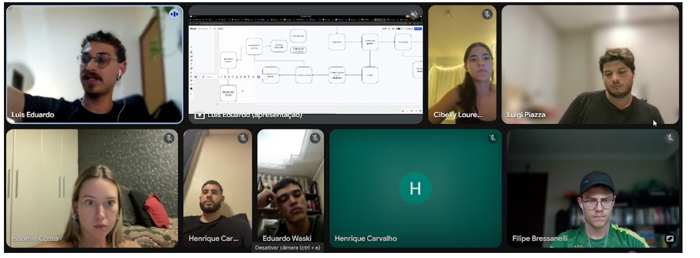
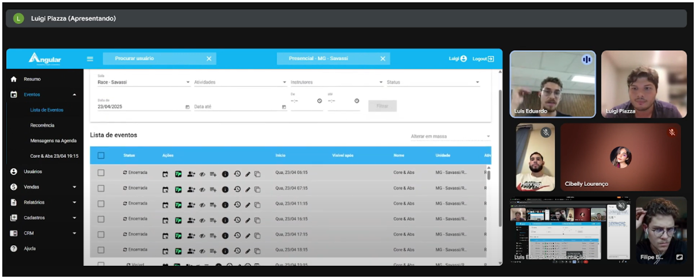
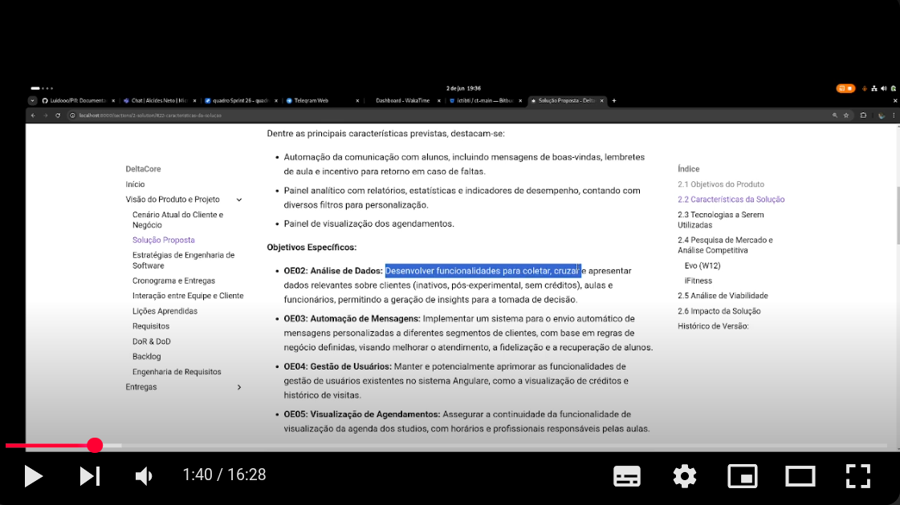

### Engenharia de Requisitos

A Engenharia de Requisitos é o processo de definir, documentar e manter os requisitos de um sistema. Para o projeto DeltaCore, adotamos as seguintes etapas:

1.  **Elicitação e Descoberta:**
    * Utilizamos **entrevistas** com o dono das franquias para compreender profundamente suas necessidades e expectativas.
    * Realizamos sessões de **brainstorming** com a equipe para gerar diversas ideias e soluções inovadoras para os problemas identificados.
    * Adotamos uma abordagem de **entrega mínima de funcionalidades (MVP)** para fornecer valor ao cliente o mais rápido possível e obter feedback inicial.

    Durante esta fase, foi estabelecido o contato inicial com a problemática do cliente. Procedeu-se à visualização das interfaces existentes, e foram levantadas as expectativas e necessidades do cliente por meio de questionamentos direcionados. Adicionalmente, foram solicitados os acessos e dados indispensáveis para a continuidade do projeto.
    
    

2.  **Análise e Consenso:**
    * Avaliamos a **viabilidade técnica** e o **sentido de cada requisito** levantado.
    * Promovemos **reuniões colaborativas** envolvendo a equipe de desenvolvimento e o cliente para discutir os requisitos, alinhar entendimentos e alcançar consenso sobre o escopo do projeto.

Nesta reunião, foram projetados os fluxos conforme as solicitações do cliente. Foi alcançado um consenso sobre os perfis de usuário (agentes) e seus respectivos percursos dentro do software, bem como os caminhos a serem percorridos pelos usuários finais do cliente. A equipe avaliou a viabilidade técnica e funcional dos requisitos, culminando na validação do escopo e na coleta de informações essenciais para o desenvolvimento das histórias de usuário.

Após a coleta inicial de dados, os requisitos identificados precisam ser analisados para verificar se são viáveis, completos, consistentes e livres de ambiguidade. Nesta reunião, foram **projetados os fluxos** conforme as solicitações do cliente, e foi alcançado um **consenso sobre os perfis de usuário** (agentes) e seus respectivos percursos dentro do software, bem como os **caminhos a serem percorridos pelos usuários finais** do cliente. A equipe avaliou a **viabilidade técnica e funcional** dos requisitos, culminando na **validação do escopo** e na **coleta de informações essenciais para o desenvolvimento das histórias de usuário**. A priorização dos requisitos também ocorre aqui, permitindo que a equipe de desenvolvimento saiba o que é mais crítico entregar primeiro.

3.  **Declaração de Requisitos:**
    * Formalizamos os requisitos utilizando diferentes formatos para garantir clareza e compreensão por todos os envolvidos:
        * **Listas de requisitos textuais:** Para descrições concisas e diretas das funcionalidades.
        * **Histórias de usuário (User Stories):** Para descrever as necessidades do ponto de vista do usuário, seguindo o formato "Eu como [usuário], quero [ação], para que [benefício]".
        A etapa de Declaração consiste em documentar formalmente os requisitos, garantindo que todos os envolvidos no projeto tenham uma referência comum e confiável. Esta etapa encontra-se **integralmente concluída e formalmente documentada** na plataforma Git Pages. Essa documentação pode assumir diferentes formas, como listas de requisitos textuais, casos de uso, histórias de usuário (user stories) ou outros formatos adequados ao contexto. Para verificação, segue o link de acesso:

* [https://mdsreq-fga-unb.github.io/2025.1-T01-FranquiAcademia/sections/9-BackLog/#fatores-avaliados](https://mdsreq-fga-unb.github.io/2025.1-T01-FranquiAcademia/sections/9-BackLog/#fatores-avaliados)

4.  **Representação de Requisitos:**
    * Utilizamos um **modelo visual interativo do produto** (protótipo) para facilitar a compreensão da interface e do fluxo de interação do sistema, permitindo que os stakeholders visualizem a solução proposta e forneçam feedback.

Embora a declaração textual seja essencial, muitos requisitos se beneficiam de formas gráficas de representação, que facilitam o entendimento e a comunicação. Nesta etapa, os requisitos são organizados por meio de diagramas, modelos ou outras estruturas visuais. Esta etapa foi efetivada por meio da **criação de protótipos**. Para acesso e verificação do material, previamente referenciado no Git Pages, seguem os respectivos links:

* [https://app.visily.ai/projects/3ba5f72a-3db6-4300-8712-1352934ac88e/boards/2044306](https://app.visily.ai/projects/3ba5f72a-3db6-4300-8712-1352934ac88e/boards/2044306)
* [https://mdsreq-fga-unb.github.io/2025.1-T01-FranquiAcademia/sections/Deploy/Deploy/](https://mdsreq-fga-unb.github.io/2025.1-T01-FranquiAcademia/sections/Deploy/Deploy/)

5.  **Verificação e Validação:**
    * **Validação:** Confirmamos se os requisitos definem a solução correta através de **reuniões de revisão** com a equipe e o cliente, garantindo que o sistema a ser desenvolvido atenda às suas reais necessidades de negócio.
    * **Verificação:** Asseguramos que os requisitos foram implementados corretamente através de **entregas incrementais de funcionalidades** e **testes de aceitação** realizados pelo cliente, garantindo a qualidade e a conformidade do sistema com as especificações.

    Antes que os requisitos sejam utilizados como base para o desenvolvimento, é fundamental garantir que estejam corretos e completos. Nesta reunião, procedeu-se à **verificação e validação dos requisitos textuais** junto ao cliente, que **aprovou formalmente a lista**. A validação busca assegurar que os requisitos realmente refletem o que os stakeholders precisam , e isso pode ser feito por meio de revisões formais, reuniões de inspeção, simulações, protótipos e testes de aceitação. O registro desta reunião encontra-se previamente referenciado na plataforma Git Pages, acessível através dos seguintes links:

* [https://www.youtube.com/watch?v=fGjIPxwdNgg&t=381s](https://www.youtube.com/watch?v=fGjIPxwdNgg&t=381s)
* [https://mdsreq-fga-unb.github.io/2025.1-T01-FranquiAcademia/sections/reunioes/02-06/#video-da-reuniao](https://mdsreq-fga-unb.github.io/2025.1-T01-FranquiAcademia/sections/reunioes/02-06/#video-da-reuniao)

    

6.  **Organização e Atualização:**
    * Gerenciamos os requisitos de forma dinâmica através de um **Backlog de Requisitos**. Este backlog é uma lista detalhada e priorizada que contém:
        * **User Stories:** Descrições das funcionalidades do ponto de vista do usuário.
        * **Critérios de Aceitação:** Condições específicas que devem ser atendidas para que uma funcionalidade seja considerada completa.
        * **Prazos de Execução:** Estimativas de tempo para o desenvolvimento de cada item do backlog.
    * O backlog é **continuamente organizado e atualizado** para refletir mudanças, novas necessidades e prioridades do projeto.

## Alinhamento com as Fases do DSDM

| Fase do DSDM                              | Atividades de ER               | Práticas                                  | Técnicas                                  | Resultado Esperado                                         |
|-----------------------------------------------|------------------------------------|-----------------------------------------------|-----------------------------------------------|----------------------------------------------------------------|
| Pré-Projeto (Pre-Project)                 | Elicitação e Descoberta            | Alinhamento inicial com stakeholders          | Brainstorming, Entrevistas                    | Clareza sobre objetivos iniciais e compreensão das necessidades |
| Estudo de Viabilidade (Feasibility Study) | Análise e Consenso                 | Avaliação técnica e de escopo inicial         | Análise de Stakeholders, Discussões Técnicas  | Verificação da viabilidade do projeto                          |
| Estudo de Negócio (Business Study)        | Declaração de Requisitos           | Definição da visão de produto e objetivos     | User Stories, Épicos, Visão de Produto         | Requisitos organizados e alinhados com o negócio               |
| Iteração do Modelo Funcional (Functional Model Iteration) | Representação                      | Criação de protótipos e modelagens            | Storyboard, Protótipos                        | Visualização inicial do sistema e validação de funcionalidades |
|                                               | Verificação e Validação            | Testes iniciais com stakeholders              | Critérios de Aceitação, INVEST                | Alinhamento entre expectativas e implementação                 |
| Iteração de Design e Construção (Design and Build Iteration) | Organização e Atualização          | Manutenção e evolução do backlog              |  MoSCoW        | Backlog refinado e priorizado com base no progresso            |
|                                               | Verificação e Validação            | Feedbacks contínuos e entregas incrementais   | Testes de Aceitação, DoR                      | Funcionalidades testadas e aceitas iterativamente              |
| Implementação (Implementation)            | Verificação e Validação            | Validação final com o cliente                 | Feedback, Workshop de Revisão                 | Entrega validada e aceita pelo cliente                         |
|                                               | Organização e Atualização          | Documentação e retrospectiva                  | Revisão Final, Lições Aprendidas              | Encerramento com aprendizado e melhoria contínua               |

## Histórico de Versão:

| Data       | Versão | Descrição                | Autor              | Revisores               |
| :--------- | :----- | :------------------------- | :----------------- | :---------------------- |
| 26/05/2025 | 1.0    | Criação do Documento     | **Filipe Bressanelli** | **Eduardo Waski** |
| 22/06/2025 | 1.1    | Modifiação das fases | **Eduardo e Henrique** | **Luis Eduardo** |
