# Product Backlog Building

É uma sigla para Product Backlog Building (PBB). É uma técnica para criar e manter uma lista de itens de trabalho para um projeto de software. O PBB tem como objetivo principal construir um backlog de forma colaborativa, de modo que todos os envolvidos no projeto compreendam o contexto do negócio. É um processo contínuo que começa antes do início do projeto e continua durante todo o ciclo de vida do projeto.

## 1. Visão do Produto

Esta seção consolida os problemas identificados e as expectativas para o sistema HealthNet, definindo o propósito e o valor do produto.

### 1.1. Problemas Atuais

A empresa enfrenta desafios significativos que impactam a eficiência operacional e a qualidade do atendimento ao paciente. Os principais problemas identificados são:

* **Sistemas Fragmentados:** Utilização de múltiplos sistemas incompatíveis entre as unidades, resultando em ilhas de informação.
* **Gestão de Prontuários Ineficiente:** Dificuldade em acessar um histórico unificado e completo dos pacientes, levando a diagnósticos e tratamentos fragmentados.
* **Processos Manuais Excessivos:** Dependência de processos manuais para agendamento, registro e gestão de medicamentos, aumentando o risco de erros.
* **Agendamento Ineficaz:** Falta de uma visão centralizada das agendas dos profissionais, causando conflitos, sobreposições e ociosidade.
* **Controle de Medicamentos Deficiente:** Risco elevado de erros na dispensação de medicamentos por falta de verificação de interações e alergias.
* **Baixa Conformidade Regulatória:** Dificuldade em gerar relatórios e garantir a conformidade com as normas de saúde expondo a organização a riscos legais.

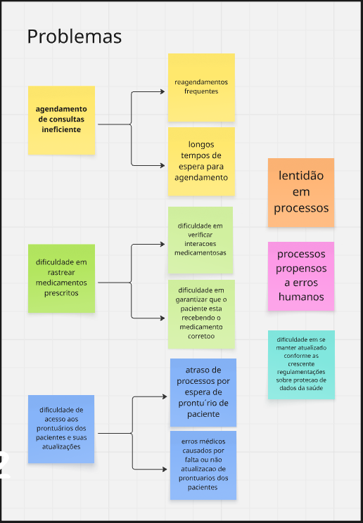

### 1.2. Expectativas para a Solução

O sistema HealthNet visa transformar o cenário atual, entregando os seguintes resultados:

* **Integração Total:** Um ecossistema de saúde unificado, onde dados de pacientes, prontuários e agendamentos são compartilhados em tempo real entre todas as unidades.
* **Usabilidade Superior:** Interfaces intuitivas e amigáveis para todas as personas, reduzindo a curva de aprendizado e otimizando o tempo de execução das tarefas.
* **Automação de Processos:** Automatização de tarefas repetitivas como agendamentos, notificações, verificações de conformidade e geração de relatórios.
* **Segurança do Paciente Aprimorada:** Redução drástica de erros médicos através de alertas inteligentes, checagem de interações medicamentosas e acesso rápido a históricos completos.
* **Conformidade Assegurada:** Ferramentas que garantem a adesão às regulamentações de saúde, com trilhas de auditoria e relatórios automáticos.
* **Melhor Experiência do Usuário:** Uma jornada mais fluida e satisfatória tanto para a equipe de saúde quanto para os pacientes.

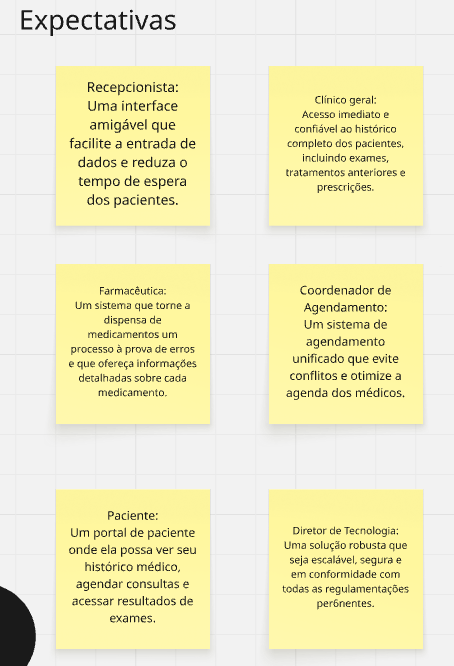

## 2. Personas

As personas a seguir representam os principais usuários do sistema e suas necessidades.

| Persona | Papel Principal (O que faz) | Expectativa com o Sistema (O que espera) |
| :--- | :--- | :--- |
| **Maria** | Recepcionista responsável pelo primeiro contato, registro e atualização de dados dos pacientes. | Interface simples e rápida para inserção de dados e agendamento. |
| **Dr. João** | Médico Clínico Geral focado no atendimento clínico, diagnóstico e prescrição. | Acesso imediato ao histórico completo do paciente e suporte à decisão clínica (alertas). |
| **Lívia** | Farmacêutica que gerencia a dispensação de medicamentos. | Sistema que valide prescrições e verifique alergias e interações medicamentosas automaticamente. |
| **Rafael** | Coordenador de Agendamento que otimiza as agendas dos profissionais de saúde. | Ferramenta unificada para gerenciar agendas, evitar conflitos e maximizar a ocupação. |
| **Sra. Clara**| Paciente que utiliza os serviços da clínica de forma regular. | Autonomia para agendar consultas online e acessar seu histórico de saúde e exames. |
| **Sr. Roberto**| Diretor de Tecnologia que supervisiona a infraestrutura de TI. | Solução segura, escalável, de fácil manutenção e em conformidade com as regulamentações. |

### Imagens das Personas

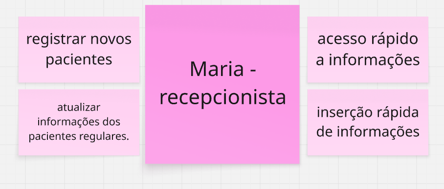
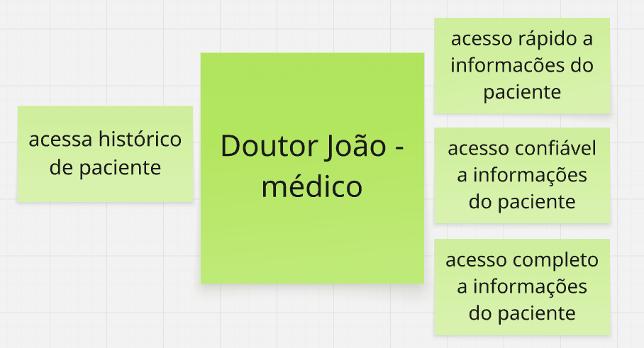
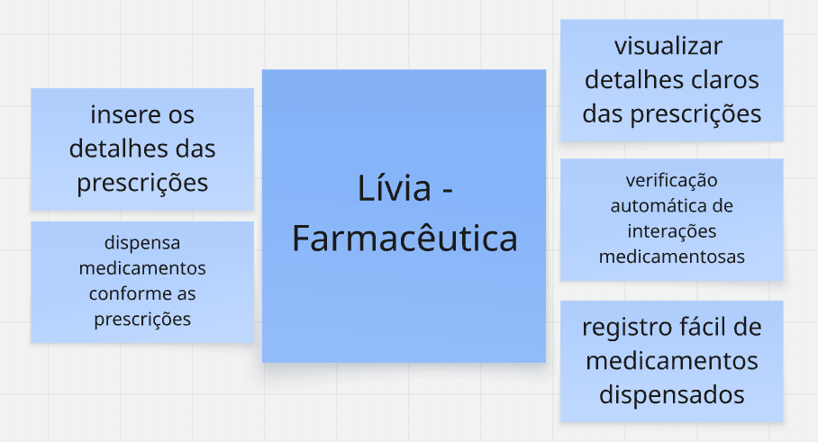
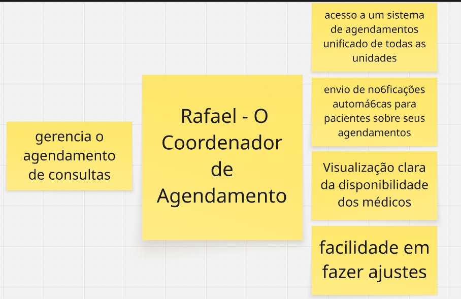
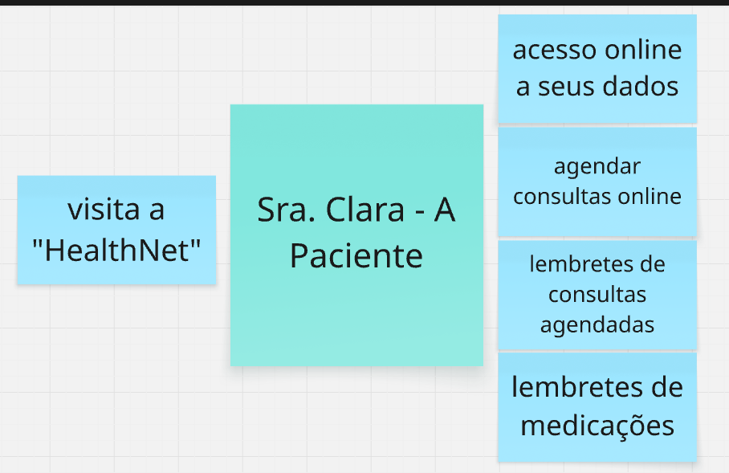
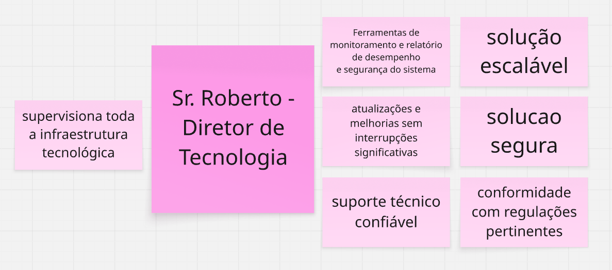

## 3. Mapa de Funcionalidades (Features)

As funcionalidades abaixo representam as grandes capacidades do sistema, que agrupam as histórias de usuário.

1.  **Cadastro Centralizado de Pacientes**
2.  **Prontuário Digital Integrado (PDI)**
3.  **Agendamento Inteligente**
4.  **Gestão Integrada de Medicamentos**
5.  **Portal do Paciente**
6.  **Sistema de Compliance e Relatórios**
7.  **Painel de Gestão Tecnológica**

<!-- 
-->
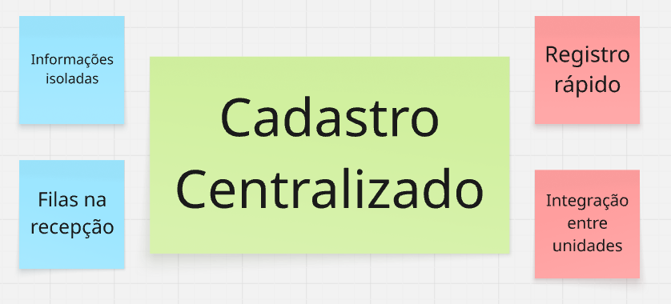
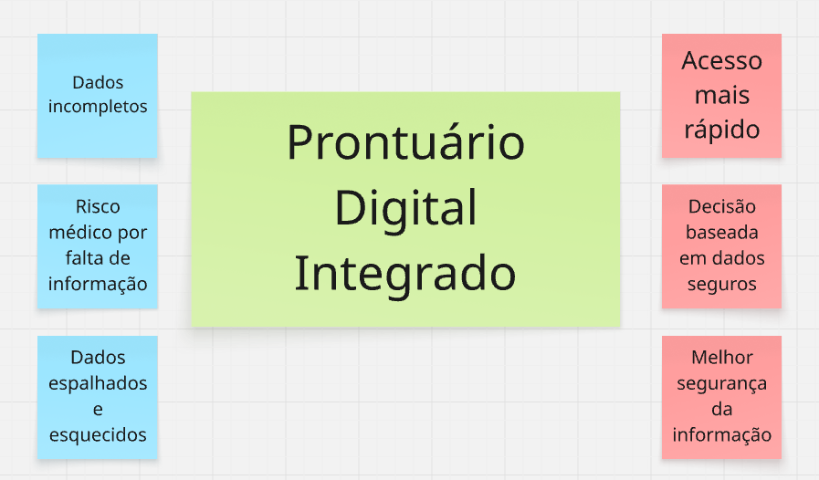
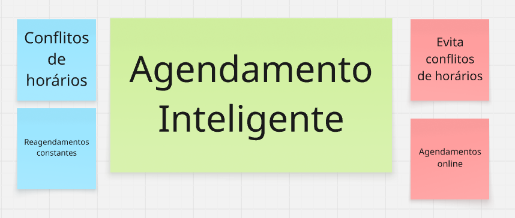
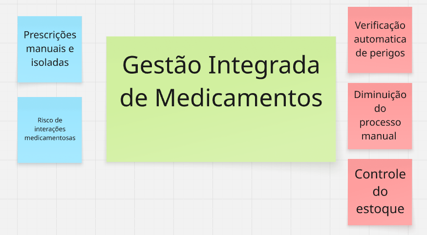
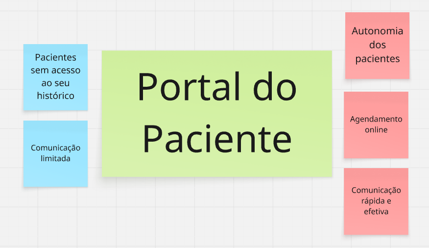
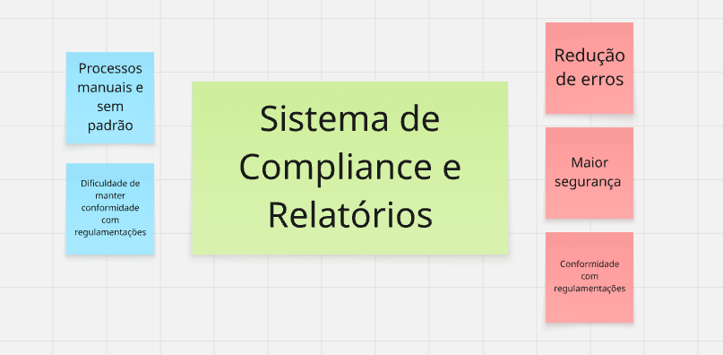
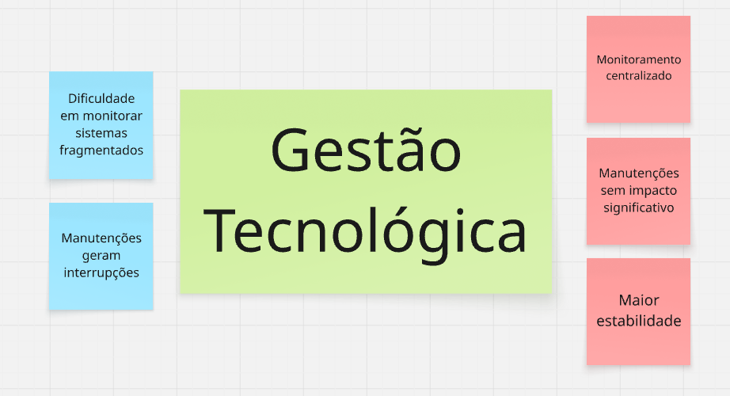

## 4. Product Backlog

A seguir, o detalhamento do Product Backlog em formato de tabelas por funcionalidade.

### Funcionalidade 1: Cadastro Centralizado de Pacientes

| ID | História de Usuário | Critérios de Aceitação | Cenário BDD (Gherkin) |
| :--- | :--- | :--- | :--- |
| **HU-01** | Como **Maria (Recepcionista)**, eu quero **registrar um novo paciente com dados completos**, para que **suas informações estejam centralizadas e acessíveis para futuros atendimentos.** | 1. O formulário deve conter os campos obrigatórios: nome completo, CPF, data de nascimento e contato. 2. O sistema deve validar o formato do CPF e impedir registros duplicados. 3. Após o registro, o paciente deve receber um número de identificação único no sistema. 4. Os dados devem estar imediatamente disponíveis para todas as unidades da franquia. | - |
| **HU-02** | Como **Dr. João (Médico)**, eu quero **consultar os dados cadastrais integrados de um paciente**, para que **eu tenha uma visão completa e possa confirmar sua identidade antes do atendimento.** | 1. A busca por paciente pode ser feita por nome completo, CPF ou número de identificação. 2. O resultado da busca deve exibir os dados pessoais e o histórico de unidades visitadas.
| **HU-03** | Como **Sr. Roberto (Diretor de TI)**, eu quero que **os dados dos pacientes sejam atualizados automaticamente entre as unidades**, para que **se garanta a consistência da informação e se evite retrabalho.** | 1. Qualquer alteração no cadastro de um paciente feita em uma unidade deve ser replicada para todas as outras. 2. O sistema deve manter um log de todas as alterações, indicando quem fez, o que foi alterado e quando. | - |

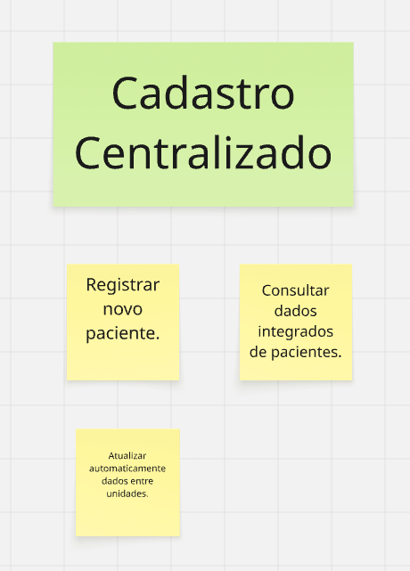

### Funcionalidade 2: Prontuário Digital Integrado (PDI)

| ID | História de Usuário | Critérios de Aceitação | Cenário BDD (Gherkin) |
| :--- | :--- | :--- | :--- |
| **HU-04** | Como **Dr. João (Médico)**, eu quero **acessar o histórico completo de consultas, exames e diagnósticos de um paciente em uma única tela**, para que **eu possa tomar decisões clínicas mais seguras e informadas.** | 1. A visualização deve ser cronológica, do atendimento mais recente ao mais antigo. 2. Deve ser possível filtrar o histórico por tipo de evento (consulta, exame, prescrição). 3. Dados de todas as unidades da franquia devem ser consolidados na mesma visão. | - |
| **HU-05** | Como **Dr. João (Médico)**, eu quero **inserir novas informações no prontuário, como diagnósticos e pedidos de exames**, para que **o registro do paciente se mantenha atualizado.** | 1. O sistema deve usar CID-10 para o registro de diagnósticos. 2. Os pedidos de exame devem ser associados ao atendimento atual. 3. A inserção deve ser assinada digitalmente (login do médico) e não pode ser alterada após salva, apenas adicionado um registro de retificação. | **Cenário:** Registro de um novo diagnóstico **Dado** que o Dr. João está na tela do prontuário da Sra. Clara **E** está realizando uma nova consulta **Quando** ele insere o diagnóstico "Hipertensão" (CID I10) **E** salva o registro da consulta **Então** o diagnóstico deve aparecer no histórico da Sra. Clara **E** deve estar associado à data e ao nome do Dr. João. |
| **HU-06** | Como **Dr. João (Médico)**, eu quero **receber alertas automáticos sobre informações críticas ou faltantes no prontuário (ex: alergias não registradas)**, para que **a segurança do paciente seja aumentada.** | 1. Ao abrir um prontuário pela primeira vez, o sistema deve exibir um alerta proeminente se o campo "Alergias" estiver vazio. 2. O alerta deve permanecer visível até que o médico confirme a ciência ou preencha a informação. | - |

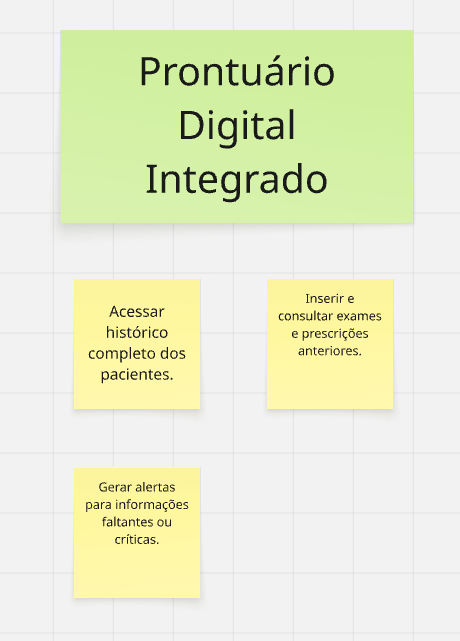

### Funcionalidade 3: Agendamento Inteligente

| ID | História de Usuário | Critérios de Aceitação | Cenário BDD (Gherkin) |
| :--- | :--- | :--- | :--- |
| **HU-07** | Como a **Sra. Clara (Paciente)**, eu quero **agendar consultas online através do portal**, para que **eu tenha conveniência e não precise ligar para a clínica.** | 1. O portal deve exibir os horários disponíveis por médico e especialidade. 2. Após a seleção, o sistema deve pedir uma confirmação antes de efetivar o agendamento. 3. Um e-mail/SMS de confirmação deve ser enviado imediatamente para a paciente. | <pre><code>**Cenário:** Agendamento com sucesso **Dado** que a Sra. Clara está logada no Portal **E** ela seleciona a especialidade e o médico **E** escolhe um horário disponível **Quando** ela clica em "Confirmar Agendamento" **Então** o sistema deve exibir "Consulta agendada!" **E** o horário deve ficar indisponível na agenda.</code></pre> |
| **HU-07** | Como a **Sra. Clara (Paciente)**, eu quero **agendar consultas online através do portal**, para que **eu tenha conveniência e não precise ligar para a clínica.** | <pre><code>**Funcionalidade:** Agendamento Online de Consultas **Cenário:** Agendamento de consulta com sucesso **Dado** que a Sra. Clara está logada no Portal do Paciente **E** ela seleciona a especialidade "Clínico Geral" e o "Dr. João" **E** escolhe um horário disponível na agenda, como "25/06/2025 às 10:00" **Quando** ela clica no botão "Confirmar Agendamento" **Então** o sistema deve exibir a mensagem "Consulta agendada com sucesso!" **E** o horário de "25/06/2025 às 10:00" deve ficar indisponível na agenda do Dr. João.</code></pre> |
| **HU-08** | Como **Rafael (Coordenador)**, eu quero que **os pacientes sejam notificados automaticamente sobre suas consultas**, para que **se reduza a taxa de não comparecimento (no-show).** | 1. A notificação de confirmação é enviada no momento do agendamento. 2. A notificação de lembrete é enviada 24 horas antes da consulta. 3. O paciente deve ter a opção de confirmar ou cancelar a consulta através do lembrete. | - |
| **HU-09** | Como **Rafael (Coordenador)**, eu quero **visualizar a disponibilidade integrada de todos os médicos em uma única tela**, para que **eu possa otimizar a alocação de horários.** | 1. A visualização deve ser em formato de calendário (diário, semanal, mensal). 2. Deve ser possível filtrar por unidade e por especialidade. 3. Horários ocupados, livres e bloqueados devem ter cores distintas. | - |

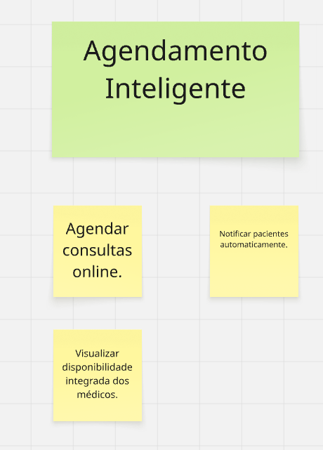

### Funcionalidade 4: Gestão Integrada de Medicamentos

| ID | História de Usuário | Critérios de Aceitação | Cenário BDD (Gherkin) |
| :--- | :--- | :--- | :--- |
| **HU-10**| Como **Lívia (Farmacêutica)**, eu quero que **o sistema verifique interações medicamentosas automaticamente**, para que **se evite reações adversas.** | 1. O sistema deve cruzar a nova prescrição com o histórico de medicamentos do paciente. 2. Se uma interação de risco for detectada, um alerta bloqueante deve ser exibido. 3. O alerta deve detalhar os medicamentos e o risco associado. | <pre><code>**Cenário:** Alerta de interação de alto risco **Dado** que a Sra. Clara usa "Varfarina" **E** o Dr. João prescreve "Aspirina" **Quando** Lívia valida a nova prescrição **Então** o sistema exibe "ALERTA DE INTERAÇÃO GRAVE" **E** a dispensação é bloqueada.</code></pre> |
| **HU-11**| Como **Lívia (Farmacêutica)**, eu quero **registrar a dispensação de cada medicamento prescrito**, para que **haja um controle de estoque e um histórico preciso.** | 1. A dispensação só pode ser registrada para uma prescrição válida. 2. O sistema deve registrar data, hora, quantidade e o farmacêutico responsável. | - |
| **HU-12**| Como **Dr. João (Médico)**, eu quero que **o sistema me alerte sobre alergias conhecidas do paciente ao prescrever**, para que **se evitem reações alérgicas graves.** | 1. Ao digitar um medicamento ao qual o paciente é alérgico, um alerta deve aparecer. 2. O sistema deve impedir a conclusão da prescrição desse medicamento. | <pre><code>**Cenário:** Tentativa de prescrever medicação alergênica **Dado** que Sra. Clara tem alergia a "Penicilina" **Quando** Dr. João tenta prescrever "Amoxicilina" **Então** o sistema exibe "ALERTA DE ALERGIA" **E** impede de salvar a prescrição.</code></pre> |
| **HU-12** | Como **Dr. João (Médico)**, eu quero que **o sistema me alerte automaticamente sobre alergias conhecidas do paciente ao prescrever um medicamento**, para que **se evitem reações alérgicas graves.** | <pre><code>**Funcionalidade:** Alerta de Alergia a Medicamentos **Cenário:** Médico tenta prescrever medicamento ao qual o paciente é alérgico **Dado** que no prontuário da Sra. Clara está registrada uma alergia a "Penicilina" **Quando** o Dr. João tenta prescrever "Amoxicilina" (um derivado da penicilina) para ela **Então** o sistema deve exibir um alerta bloqueante com a mensagem: "ALERTA DE ALERGIA: Paciente possui alergia a Penicilina." **E** o botão para salvar a prescrição deve ficar desabilitado.</code></pre> |

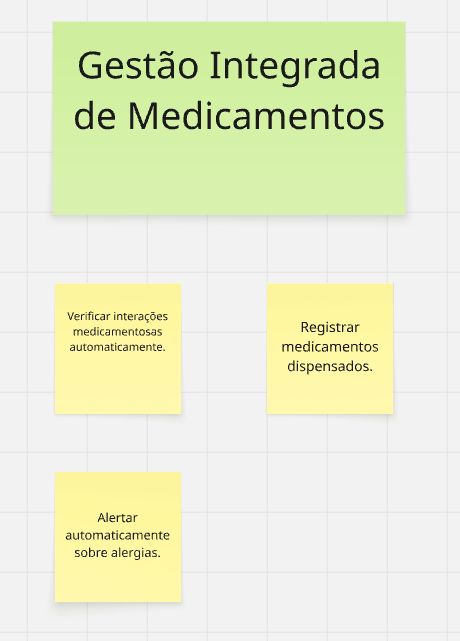

### Funcionalidade 5: Portal do Paciente

| ID | História de Usuário | Critérios de Aceitação | Cenário BDD (Gherkin) |
| :--- | :--- | :--- | :--- |
| **HU-13**| Como a **Sra. Clara (Paciente)**, eu quero **consultar meus resultados de exames e histórico pelo portal**, para que **eu possa acompanhar minha saúde.** | 1. O portal deve listar todos os exames com seus respectivos laudos. 2. O acesso deve ser protegido por autenticação de dois fatores. | <pre><code>**Cenário:** Paciente consulta resultado **Dado** que Sra. Clara está logada no Portal **E** navega para "Meus Exames" **Quando** ela clica no "Hemograma Completo" **Então** o sistema deve exibir o laudo do exame.</code></pre> |
| **HU-13** | Como a **Sra. Clara (Paciente)**, eu quero **consultar meus resultados de exames e meu histórico de saúde pelo portal**, para que **eu possa acompanhar minha saúde de forma proativa.** | <pre><code>**Funcionalidade:** Acesso a Resultados de Exames no Portal **Cenário:** Paciente consulta um resultado de exame recente **Dado** que a Sra. Clara está logada no Portal do Paciente **E** ela navega para a seção "Meus Exames" **Quando** ela clica no exame "Hemograma Completo" realizado na última semana **Então** o sistema deve exibir o laudo completo do exame em formato PDF **E** o status do exame deve ser "Resultado Disponível".</code></pre> |
| **HU-14**| Como a **Sra. Clara (Paciente)**, eu quero **receber notificações e lembretes importantes sobre minha saúde pelo portal**, para que **eu não perca compromissos.** | 1. O portal deve ter uma área de "Notificações". 2. Notificações devem ser geradas para: confirmação de consulta, lembrete, resultado de exame disponível. | - |

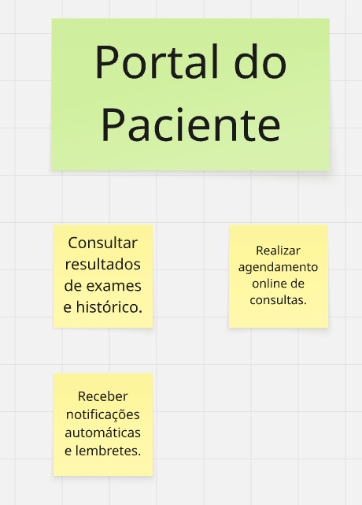

### Funcionalidade 6: Sistema de Compliance e Relatórios

| ID | História de Usuário | Critérios de Aceitação | Cenário BDD (Gherkin) |
| :--- | :--- | :--- | :--- |
| **HU-15**| Como **Sr. Roberto (Diretor de TI)**, eu quero que **o sistema colete e consolide dados para conformidade regulatória automaticamente**, para que **se reduza o esforço manual em auditorias.** | 1. O sistema deve registrar todos os acessos aos prontuários (quem, quando, o quê). 2. Os logs devem ser armazenados de forma segura e inviolável. | - |
| **HU-16**| Como **Sr. Roberto (Diretor de TI)**, eu quero **gerar relatórios de conformidade e operacionais**, para que **a gestão tenha dados para a tomada de decisão.** | 1. O sistema deve oferecer uma biblioteca de relatórios pré-definidos. 2. Deve ser possível exportar os relatórios nos formatos PDF e CSV. | - |
| **HU-16** | Como **Sr. Roberto (Diretor de TI)**, eu quero **gerar relatórios de conformidade e operacionais (ex: taxa de no-show, tempo médio de atendimento)**, para que **a gestão tenha dados para a tomada de decisão estratégica.** | <pre><code>**Funcionalidade:** Geração de Relatórios **Cenário:** Diretor de TI gera um relatório de taxa de não comparecimento **Dado** que o Sr. Roberto, Diretor de TI, está logado no sistema com permissões de administrador **E** ele navega para a seção de "Relatórios Operacionais" **Quando** ele seleciona o relatório "Taxa de Não Comparecimento (No-Show)" para o último mês **E** clica em "Gerar Relatório" **Então** o sistema deve exibir um relatório detalhando a porcentagem de consultas em que os pacientes não compareceram **E** deve haver uma opção para exportar o relatório em formato PDF.</code></pre> |

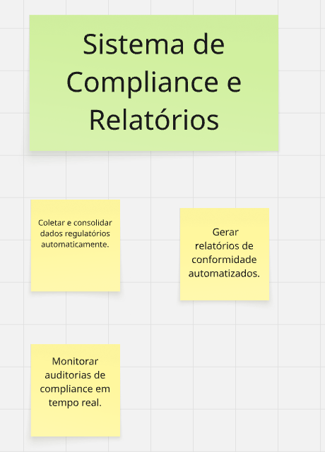

### Funcionalidade 7: Painel de Gestão Tecnológica

| ID | História de Usuário | Critérios de Aceitação | Cenário BDD (Gherkin) |
| :--- | :--- | :--- | :--- |
| **HU-17**| Como **Sr. Roberto (Diretor de TI)**, eu quero **monitorar a segurança e o desempenho do sistema através de um painel**, para que **eu possa garantir a disponibilidade e a integridade da solução.** | - | - |
| **HU-17** | Como **Sr. Roberto (Diretor de TI)**, eu quero **monitorar a segurança e o desempenho do sistema através de um painel**, para que **eu possa garantir a disponibilidade e a integridade da solução.** | <pre><code>**Funcionalidade:** Monitoramento de Desempenho do Sistema **Cenário:** Diretor de TI verifica o status do sistema no painel **Dado** que o Sr. Roberto, Diretor de TI, acessa o "Painel de Gestão Tecnológica" **Quando** a página do painel carrega **Então** ele deve visualizar widgets mostrando o tempo de atividade (uptime) do sistema, o tempo médio de resposta das requisições e o uso atual da CPU **E** o status geral do sistema deve ser exibido como "Operacional" com um indicador verde.</code></pre> |
| **HU-18**| Como **Sr. Roberto (Diretor de TI)**, eu quero **gerenciar o suporte técnico de forma integrada**, para que **os chamados dos usuários sejam resolvidos eficientemente.** | - | - |

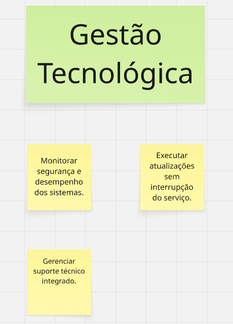
