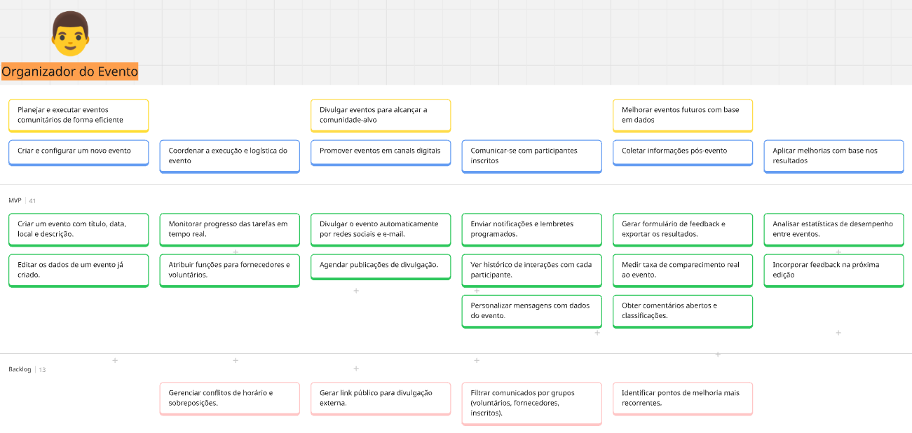
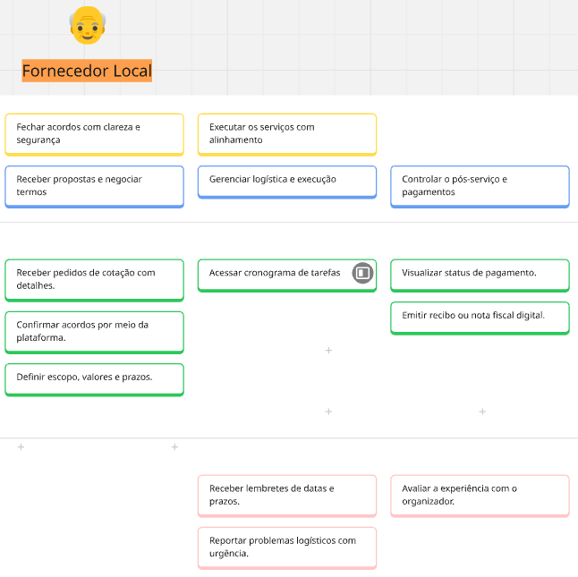
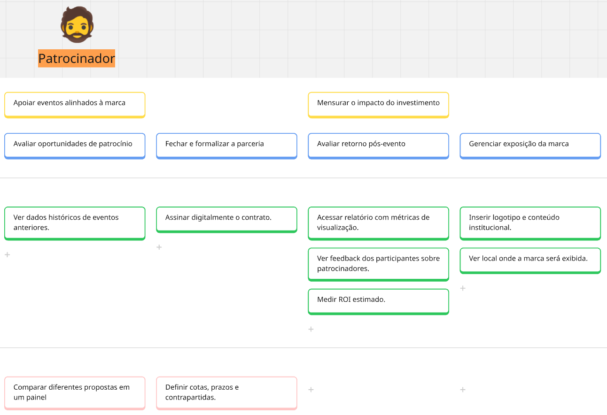
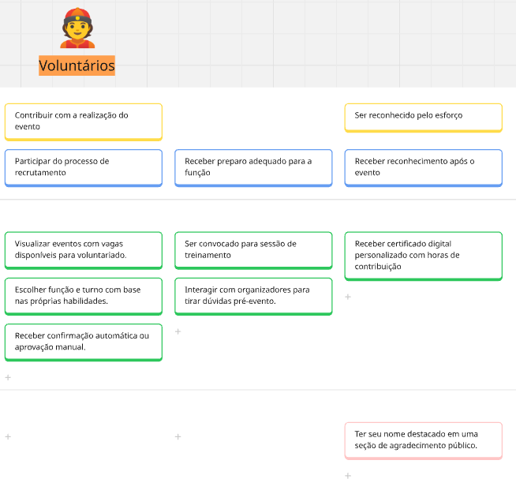

<!--

# User Story Mapping (USM): Sistema de Gestão de Eventos "EventFlow"

Este documento apresenta a aplicação da técnica de **User Story Mapping (USM)** para planejar o desenvolvimento do sistema "EventFlow". [cite_start]O USM é uma ferramenta valiosa que transforma um backlog de produto em uma representação visual e estruturada, ajudando a equipe a manter o foco nos usuários e em sua jornada. [cite_start]O mapa mostra a "espinha dorsal" (*backbone*) do produto e detalha as funcionalidades em releases incrementais.

## 1. O que é uma História de Usuário?

[cite_start]Uma história de usuário é um requisito de software escrito na perspectiva do usuário final, focada em uma característica específica que agrega valor. [cite_start]Geralmente, segue o formato: "**Eu, como** `<papel>`, **quero** `<ação>` **para** `<valor de negócio>`".

## 2. Personas do EventFlow

#### Organizador do Evento
* **O que faz:** Planeja, promove e gerencia todos os aspectos de um evento.
* **O que espera:** Uma plataforma centralizada para gerenciar inscrições, pagamentos, comunicação e logística.
    

#### Fornecedor Local
* **O que faz:** Oferece serviços essenciais para eventos (catering, equipamentos, etc.).
* **O que espera:** Um canal para se conectar com organizadores, divulgar serviços e gerenciar contratações.
    

#### Patrocinador
* **O que faz:** Investe em eventos em troca de visibilidade.
* **O que espera:** Ferramentas para identificar eventos, analisar público e medir o ROI.
    

#### Voluntário do Evento
* **O que faz:** Doa seu tempo e habilidades para apoiar a execução de eventos.
* **O que espera:** Um sistema para encontrar oportunidades, se inscrever para turnos e receber tarefas.
    

## 3. User Story Map: EventFlow

O mapa abaixo organiza as tarefas dos usuários (linhas) ao longo da jornada do produto (*backbone*, nas colunas) e as agrupa em releases para entrega de valor incremental.

| **Backbone** | **1. Planejamento do Evento** | **2. Divulgação e Venda** | **3. Gestão de Recursos** | **4. Experiência do Participante** | **5. Pós-Evento** |
| :--- | :--- | :--- | :--- | :--- | :--- |
| **Atividades** | `(Organizador)` | `(Organizador, Participante, Patrocinador)` | `(Organizador, Fornecedor, Voluntário)` | `(Participante, Organizador)` | `(Organizador, Participante)` |
| **MVP 1** | Criar novo evento (data, local, descrição) | Publicar página do evento | | Fazer inscrição (ingresso gratuito) | |
| | Definir tipos de ingresso (Gratuito, VIP) | Gerar link de compartilhamento | Cadastrar fornecedores manualmente | Visualizar programação do evento | Enviar e-mail de agradecimento |
| | | | | Check-in no evento por QR Code | |
| **MVP 2** | Configurar formulário de inscrição | Integração de pagamento (cartão de crédito) | Sistema de candidatura para fornecedores | App do evento com mapa interativo | Coletar feedback dos participantes |
| | Ferramenta de orçamento simples | Criar lotes de ingressos com virada de preço | Portal para voluntários (inscrição e turnos) | Sistema de notificação (push) | Emitir certificado de participação |
| **Releases Futuras**| Clonar um evento existente | Programa de afiliados para divulgadores | Avaliação de fornecedores | Gamificação (pontos por interação) | Análise de dados e relatórios (ROI) |
| | Módulo de gestão de palestrantes | Integração com redes sociais (login) | Alocação de tarefas para voluntários | Chat em tempo real entre participantes | Galeria de fotos e vídeos |
| | | Módulo de patrocínio (cotas e benefícios) | | | |

---
-->

# User Story Mapping (USM): Sistema de Gestão de Eventos "EventFlow"

Este documento apresenta a aplicação da técnica de **User Story Mapping (USM)** para planejar o desenvolvimento do sistema "EventFlow". O USM organiza um backlog de produto em uma representação visual e estruturada, focada na jornada do usuário. O mapa mostra a "espinha dorsal" do produto e detalha as funcionalidades em releases incrementais.

[Link para o board no Miro](https://miro.com/app/board/uXjVImBBpoM=/?share_link_id=114219219767)

## 1. Personas do EventFlow

| Persona | O que faz | O que espera |
| :--- | :--- | :--- | 
| **Organizador do Evento** | Planeja, promove e gerencia todos os aspectos de um evento. | Uma plataforma centralizada para gerenciar inscrições, pagamentos, comunicação e logística. |
| **Fornecedor Local** | Oferece serviços essenciais para eventos (catering, equipamentos, etc.). | Um canal para se conectar com organizadores, divulgar serviços e gerenciar contratações. | 
| **Participante do Evento** | Compra ingressos e participa dos eventos. | Um processo de inscrição simples, acesso fácil à programação e uma boa experiência geral. | 
| **Voluntário do Evento** | Doa seu tempo e habilidades para apoiar a execução de eventos. | Um sistema para encontrar oportunidades, se inscrever para turnos e receber tarefas. |

 
 
 

## 2. Histórias de Usuário por Atividade e Release

### Planejamento do Evento
**Atividade Principal do Usuário (Organizador):** Definir e configurar os detalhes fundamentais de um novo evento.

| Release | História de Usuário (HU) | Critérios de Aceitação |
| :--- | :--- | :--- |
| **MVP 1** | **HU-01:** Como **Organizador**, eu quero **criar um novo evento** informando nome, data, local e uma descrição, para que **a base do evento seja estabelecida no sistema.** | 1. O formulário de criação deve ter campos obrigatórios para: Nome do Evento, Data de Início, Data de Fim, Local e Descrição. 2. O sistema deve validar que a data de fim não seja anterior à data de início. 3. Ao salvar, o evento deve receber um status "Rascunho" e uma URL única. |
| **MVP 1** | **HU-02:** Como **Organizador**, eu quero **definir os tipos de ingresso** (ex: Gratuito, VIP), para que **os participantes possam escolher como participar.** | 1. Deve ser possível criar um ingresso com nome (ex: "Entrada Geral") e preço. 2. O preço pode ser definido como "0" para ingressos gratuitos. 3. Cada tipo de ingresso deve ter um campo para definir a quantidade total disponível. |
| **MVP 2** | **HU-03:** Como **Organizador**, eu quero **configurar um formulário de inscrição personalizado**, para que **eu possa coletar informações específicas dos participantes.** | 1. Além dos campos padrão (nome, e-mail), deve ser possível adicionar campos extras (ex: empresa, cargo, restrição alimentar). 2. O organizador pode marcar os campos adicionais como obrigatórios ou opcionais. |
| **MVP 2** | **HU-04:** Como **Organizador**, eu quero **criar uma ferramenta de orçamento simples**, para que **eu possa controlar as despesas e receitas do evento.** | 1. A ferramenta deve permitir registrar itens de despesa (nome, valor estimado) e de receita. 2. O sistema deve calcular e exibir o total de despesas, receitas e o saldo projetado. |
| **Futuro** | **HU-05:** Como **Organizador**, eu quero **clonar um evento existente**, para que **eu possa reutilizar configurações e agilizar a criação de eventos recorrentes.** | 1. Deve haver um botão "Clonar Evento" na página de um evento já criado. 2. Ao clonar, o sistema deve copiar todas as configurações (descrição, tipos de ingresso, formulário) para um novo evento em modo "Rascunho", permitindo a edição das novas datas. |

### Divulgação e Venda
**Atividade Principal do Usuário (Organizador, Participante):** Promover o evento e gerenciar a venda de ingressos.

| Release | História de Usuário (HU) | Critérios de Aceitação |
| :--- | :--- | :--- |
| **MVP 1** | **HU-06:** Como **Organizador**, eu quero **publicar a página do evento**, para que **ela fique visível e acessível ao público para inscrições.** | 1. Um evento em "Rascunho" deve ter um botão "Publicar". 2. Após a publicação, a URL do evento deve se tornar ativa e acessível publicamente. 3. A página pública deve exibir o nome, data, local, descrição e os tipos de ingresso disponíveis. |
| **MVP 1** | **HU-07:** Como **Participante**, eu quero **fazer minha inscrição em um evento**, para que **eu possa garantir minha vaga.** | 1. Na página do evento, devo poder selecionar o tipo e a quantidade de ingressos. 2. Devo preencher um formulário com meus dados (nome, e-mail). 3. Após a inscrição, devo receber um e-mail de confirmação com os detalhes do evento e um QR Code de acesso. |
| **MVP 2** | **HU-08:** Como **Organizador**, eu quero **integrar um sistema de pagamento com cartão de crédito**, para que **eu possa vender ingressos pagos de forma segura.** | 1. O sistema deve estar integrado a um gateway de pagamento (ex: Stripe, PagSeguro). 2. O fluxo de compra deve ser seguro (HTTPS). 3. A confirmação da inscrição só deve ocorrer após a aprovação do pagamento. |
| **MVP 2** | **HU-09:** Como **Organizador**, eu quero **criar lotes de ingressos com virada de preço automática**, para que **eu possa incentivar a compra antecipada.** | 1. Ao criar um tipo de ingresso, deve ser possível definir lotes com datas de início/fim e preços diferentes (ex: Lote 1 até DD/MM/AAAA por R$50, Lote 2 após essa data por R$70). 2. O sistema deve mudar o preço automaticamente na data configurada. |

### Gestão de Recursos
**Atividade Principal do Usuário (Organizador, Fornecedor, Voluntário):** Coordenar as pessoas e serviços necessários para o evento.

| Release | História de Usuário (HU) | Critérios de Aceitação |
| :--- | :--- | :--- |
| **MVP 1** | **HU-10:** Como **Organizador**, eu quero **cadastrar fornecedores manualmente no sistema**, para que **eu tenha uma lista de contatos centralizada.** | 1. O formulário de cadastro de fornecedor deve conter: nome da empresa, serviço prestado (ex: buffet) e contato. 2. A lista de fornecedores deve ser visível apenas para o organizador. |
| **MVP 2** | **HU-11:** Como **Fornecedor**, eu quero **me candidatar para prestar serviços em um evento**, para que **eu possa conseguir novos contratos.** | 1. Deve haver uma área pública onde fornecedores possam ver os eventos que aceitam candidaturas. 2. O fornecedor deve preencher um formulário de candidatura com seus dados e portfólio. 3. O organizador deve receber uma notificação para avaliar as candidaturas. |
| **MVP 2** | **HU-12:** Como **Voluntário**, eu quero **me inscrever para atuar em um evento e escolher meus turnos**, para que **eu possa contribuir com meu tempo.** | 1. Deve existir um portal para voluntários com a lista de eventos disponíveis. 2. Ao escolher um evento, devo ver as áreas e os turnos disponíveis (ex: "Credenciamento - 08h às 12h"). 3. Após a inscrição, minha vaga no turno deve ser confirmada pelo organizador. |
| **Futuro**| **HU-13:** Como **Organizador**, eu quero **alocar tarefas específicas para voluntários**, para que **todos saibam suas responsabilidades durante o evento.** | 1. Dentro do portal de voluntários, o organizador deve poder atribuir tarefas a um voluntário específico (ex: "Entregar kits para palestrantes"). 2. O voluntário deve receber uma notificação sobre a nova tarefa. |

### Experiência do Participante
**Atividade Principal do Usuário (Participante, Organizador):** Garantir uma experiência fluida e engajadora durante o evento.

| Release | História de Usuário (HU) | Critérios de Aceitação |
| :--- | :--- | :--- |
| **MVP 1** | **HU-14:** Como **Organizador**, eu quero **fazer o check-in de participantes usando um leitor de QR Code**, para que **o acesso ao evento seja rápido e controlado.** | 1. O organizador deve ter acesso a uma tela de check-in que ative a câmera do celular/dispositivo. 2. Ao ler o QR Code do ingresso do participante, o sistema deve validar a inscrição. 3. O sistema deve exibir uma mensagem de "Check-in Válido" ou "Ingresso Inválido/Já Utilizado" e registrar o horário de entrada. |
| **MVP 2** | **HU-15:** Como **Participante**, eu quero **acessar um app do evento com a programação e um mapa interativo**, para que **eu possa me orientar e não perder atividades.** | 1. O app deve ter uma seção "Programação" com horários, temas e locais de cada palestra/atividade. 2. O app deve ter uma seção "Mapa" com os pontos importantes sinalizados (palcos, banheiros, praça de alimentação). |

### Pós-Evento
**Atividade Principal do Usuário (Organizador, Participante):** Finalizar o evento e coletar dados para melhorias futuras.

| Release | História de Usuário (HU) | Critérios de Aceitação |
| :--- | :--- | :--- |
| **MVP 1** | **HU-16:** Como **Organizador**, eu quero **enviar um e-mail de agradecimento para todos os participantes**, para que **eu possa manter um bom relacionamento com meu público.** | 1. O sistema deve permitir redigir um e-mail padrão de agradecimento. 2. Deve haver uma função para disparar o e-mail para a lista de todos os participantes que fizeram check-in no evento. 3. O envio deve ser feito em lote, e não um por um. |
