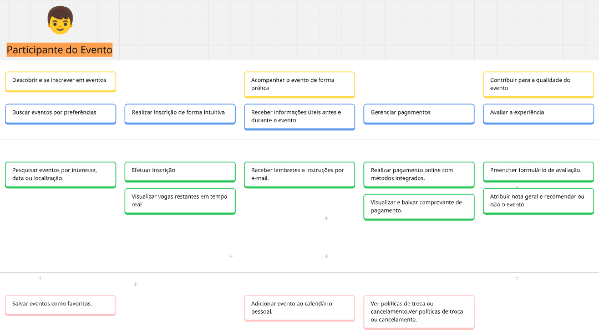

# User Story Mapping (USM)
## Sistema de Gestão de Eventos "ComunEventos"

Este documento apresenta a aplicação da técnica de **User Story Mapping (USM)** para planejar o desenvolvimento do sistema "ComunEventos". O USM organiza um backlog de produto em uma representação visual e estruturada, focada na jornada do usuário. O mapa mostra a "espinha dorsal" do produto e detalha as funcionalidades em releases incrementais.

[Link para o board no Miro](https://miro.com/app/board/uXjVImBBpoM=/?share_link_id=114219219767)

## 1. Personas do ComunEventos

| Persona | O que faz | O que espera |
| :--- | :--- | :--- | 
| **Organizador do Evento** | Planeja, promove e gerencia todos os aspectos de um evento. | Uma plataforma centralizada para gerenciar inscrições, pagamentos, comunicação e logística. |
| **Fornecedor Local** | Oferece serviços essenciais para eventos (catering, equipamentos, etc.). | Um canal para se conectar com organizadores, divulgar serviços e gerenciar contratações. | 
| **Participante do Evento** | Compra ingressos e participa dos eventos. | Um processo de inscrição simples, acesso fácil à programação e uma boa experiência geral. | 
| **Voluntário do Evento** | Doa seu tempo e habilidades para apoiar a execução de eventos. | Um sistema para encontrar oportunidades, se inscrever para turnos e receber tarefas. |

### novo

 
| ID     | Funcionalidade                                                               | História de Usuário                                                                                       | Critérios de Aceitação                                                                                      |
|--------|------------------------------------------------------------------------------|-----------------------------------------------------------------------------------------------------------|-------------------------------------------------------------------------------------------------------------|
| US01   | Criar um evento com título, data, local e descrição                         | Como organizador, quero criar um evento com título, data, local e descrição para iniciar o planejamento. | - O formulário deve conter campos obrigatórios de título, data, local e descrição.                         |
|        |                                                                              |                                                                                                           | - O sistema deve validar o preenchimento de todos os campos antes de permitir a criação do evento.        |
|        |                                                                              |                                                                                                           | - Após a criação, o evento deve aparecer imediatamente na lista do organizador.                            |
| US02   | Editar os dados de um evento já criado                                      | Como organizador, quero editar os dados de um evento já criado para atualizar informações quando necessário. |                                                                                                             |
| US03   | Monitorar progresso das tarefas em tempo real                               | Como organizador, quero monitorar o progresso das tarefas em tempo real para garantir que tudo está no prazo. |                                                                                                             |
| US04   | Atribuir funções para fornecedores e voluntários                            | Como organizador, quero atribuir funções para fornecedores e voluntários para organizar melhor a execução. |                                                                                                             |
| US05   | Divulgar o evento automaticamente por redes sociais e e-mail                | Como organizador, quero divulgar o evento automaticamente para alcançar mais participantes.               | - O sistema deve permitir vincular redes sociais e configurar canais de e-mail.                            |
|        |                                                                              |                                                                                                           | - A publicação deve ocorrer automaticamente após agendamento ou ativação manual.                           |
|        |                                                                              |                                                                                                           | - O organizador deve receber uma notificação de sucesso ou erro da publicação.                             |
| US06   | Agendar publicações de divulgação                                           | Como organizador, quero agendar publicações para manter presença constante nas redes.                     |                                                                                                             |
| US07   | Enviar notificações e lembretes programados                                 | Como organizador, quero enviar notificações programadas para manter os participantes informados.          | - O sistema deve permitir selecionar data e hora para envio das notificações.                              |
|        |                                                                              |                                                                                                           | - Os participantes devem receber notificações por e-mail ou push com as informações do evento.             |
|        |                                                                              |                                                                                                           | - O sistema deve exibir histórico das notificações enviadas.                                               |
| US08   | Ver histórico de interações com cada participante                           | Como organizador, quero ver o histórico de interações para entender o engajamento de cada pessoa.         |                                                                                                             |
| US09   | Personalizar mensagens com dados do evento                                  | Como organizador, quero personalizar mensagens com informações específicas para torná-las mais eficazes.   |                                                                                                             |
| US10   | Gerar formulário de feedback e exportar os resultados                       | Como organizador, quero gerar e exportar um formulário de feedback para avaliar a satisfação dos participantes. |                                                                                                          |
| US11   | Medir taxa de comparecimento real ao evento                                 | Como organizador, quero saber quantos inscritos realmente compareceram.                                   |                                                                                                             |
| US12   | Obter comentários abertos e classificações                                  | Como organizador, quero acessar feedback qualitativo e quantitativo.                                      |                                                                                                             |
| US13   | Analisar estatísticas de desempenho entre eventos                           | Como organizador, quero comparar o desempenho entre eventos para saber o que está funcionando.            | - O sistema deve exibir gráficos com métricas como: inscritos, comparecimento, avaliações e engajamento.  |
|        |                                                                              |                                                                                                           | - Deve ser possível filtrar comparações por data, tipo de evento ou local.                                 |
|        |                                                                              |                                                                                                           | - As estatísticas devem ser exportáveis em formato PDF ou CSV.                                             |
| US14   | Incorporar feedback na próxima edição                                       | Como organizador, quero usar feedback para melhorar os próximos eventos.                                  |                                                                                                             |

| ID     | Funcionalidade                                                               | História de Usuário                                                                                     | Critérios de Aceitação                                                                                          |
|--------|------------------------------------------------------------------------------|---------------------------------------------------------------------------------------------------------|------------------------------------------------------------------------------------------------------------------|
| US15   | Pesquisar eventos por interesse, data ou localização                         | Como participante, quero buscar eventos por interesse, data ou local para encontrar os que me interessam. | - O sistema deve permitir busca por palavra-chave, local e data.                                                |
|        |                                                                              |                                                                                                         | - A busca deve exibir resultados em lista com título, data e local.                                             |
|        |                                                                              |                                                                                                         | - A busca deve retornar apenas eventos públicos e ativos.                                                       |
| US16   | Efetuar inscrição                                                            | Como participante, quero me inscrever de forma rápida para garantir minha participação.                 | - O botão de inscrição deve estar visível para eventos com vagas disponíveis.                                  |
|        |                                                                              |                                                                                                         | - Após inscrição bem-sucedida, o participante deve receber confirmação por e-mail.                             |
|        |                                                                              |                                                                                                         | - O evento inscrito deve aparecer na área pessoal do participante.                                              |
| US17   | Visualizar vagas restantes em tempo real                                     | Como participante, quero saber se ainda há vagas disponíveis antes de me inscrever.                     |                                                                                                                  |
| US18   | Receber lembretes e instruções por e-mail                                    | Como participante, quero receber lembretes e instruções antes do evento.                                |                                                                                                                  |
| US19   | Realizar pagamento online com métodos integrados                             | Como participante, quero pagar com facilidade usando métodos online.                                    | - O sistema deve oferecer ao menos duas formas de pagamento (ex: Pix e cartão).                                |
|        |                                                                              |                                                                                                         | - O pagamento deve gerar confirmação imediata ou mensagem de erro.                                             |
|        |                                                                              |                                                                                                         | - O sistema deve registrar a transação na área do participante.                                                |
| US20   | Visualizar e baixar comprovante de pagamento                                 | Como participante, quero acessar meu comprovante após o pagamento.                                      |                                                                                                                  |
| US21   | Preencher formulário de avaliação                                            | Como participante, quero avaliar o evento para dar meu feedback.                                        |                                                                                                                  |
| US22   | Atribuir nota geral e recomendar ou não o evento                             | Como participante, quero indicar se gostei do evento e se o recomendaria.                               |

 
| ID     | Funcionalidade                              | História de Usuário                                                                                       | Critérios de Aceitação                                                                                               |
|--------|---------------------------------------------|-----------------------------------------------------------------------------------------------------------|-----------------------------------------------------------------------------------------------------------------------|
| US23   | Receber pedidos de cotação com detalhes     | Como fornecedor, quero receber pedidos claros para avaliar viabilidade e custo.                           | - O pedido de cotação deve conter: tipo de serviço, data do evento, quantidade, local e horário estimado.           |
|        |                                             |                                                                                                           | - O sistema deve permitir visualizar o pedido em um painel e responder com proposta.                                 |
|        |                                             |                                                                                                           | - O pedido deve ser recebido via notificação ou painel central do fornecedor.                                        |
| US24   | Confirmar acordos por meio da plataforma    | Como fornecedor, quero confirmar acordos online para garantir segurança nas contratações.                |                                                                                                                       |
| US25   | Definir escopo, valores e prazos            | Como fornecedor, quero definir escopo e prazos para alinhar expectativas.                                 |                                                                                                                       |
| US26   | Acessar cronograma de tarefas               | Como fornecedor, quero ver o cronograma para me organizar para o evento.                                 |                                                                                                                       |
| US27   | Visualizar status de pagamento              | Como fornecedor, quero acompanhar o status do pagamento após a entrega.                                  | - O sistema deve mostrar se o pagamento está pendente, processando ou concluído.                                     |
|        |                                             |                                                                                                           | - O status deve estar disponível em tempo real após a finalização do serviço.                                        |
|        |                                             |                                                                                                           | - Deve haver uma data estimada de pagamento visível junto ao status.                                                 |
| US28   | Emitir recibo ou nota fiscal digital        | Como fornecedor, quero emitir documentos fiscais diretamente pela plataforma.                             |   
