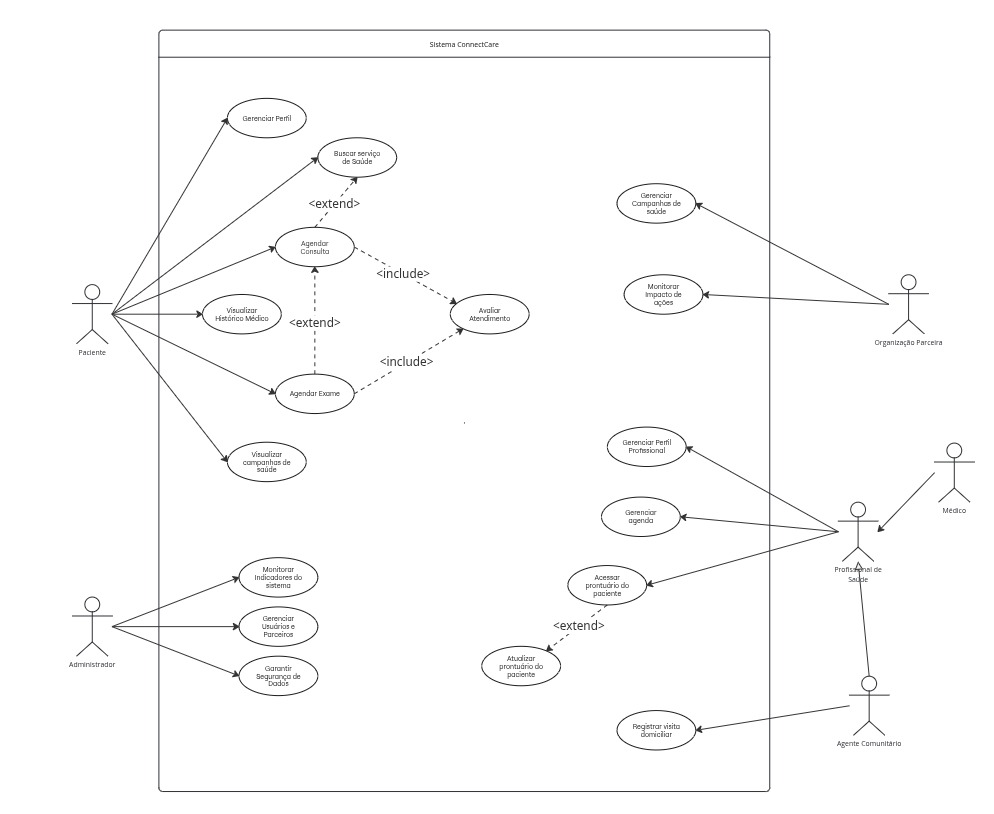

### Atores e Casos de Uso do Sistema ConnectCare

Utilizamos um Diagrama de Casos de Uso para apresentar uma visão externa das funções e serviços oferecidas aos usuários da plataforma ConnectCare. O diagrama ilustra as interações entre os diferentes atores e os processos do sistema.

[Link para o diagrama em versão pdf.](images/diagrama.pdf)

| Ator | Descrição |
| :--- | :--- |
| Paciente | Usuário principal que busca e acessa serviços de saúde, agenda consultas, exames e visualiza seu histórico médico. |
| Profissional de Saúde | Médicos, enfermeiros e agentes comunitários que usam o sistema para gerenciar atendimentos e acessar ou atualizar os prontuários dos pacientes. |
| Organização Parceira | ONGs, hospitais ou instituições governamentais que divulgam, gerenciam e monitoram o impacto de suas campanhas e iniciativas de saúde. |
| Administrador do Sistema | Responsável por manter o sistema, monitorar indicadores de desempenho, gerenciar usuários e parceiros, e garantir a segurança dos dados. |

A tabela abaixo detalha os atores que interagem com o sistema e as ações (casos de uso) que cada um pode realizar, conforme representado no diagrama de casos de uso.

| Ator                      | Casos de Uso                                                                                                                                                                                   |
| :------------------------ | :--------------------------------------------------------------------------------------------------------------------------------------------------------------------------------------------- |
| **Paciente** | <ul><li>Gerenciar Perfil</li><li>Agendar Consulta</li><li>Visualizar Histórico Médico</li><li>Agendar Exame</li><li>Visualizar campanhas de saúde</li><li>Avaliar Atendimento</li><li>Buscar serviço de Saúde</li></ul> |
| **Administrador** | <ul><li>Monitorar Indicadores do sistema</li><li>Gerenciar Usuários e Parceiros</li><li>Garantir Segurança de Dados</li></ul>                                                                     |
| **Organização Parceira** | <ul><li>Gerenciar Campanhas de saúde</li><li>Monitorar Impacto de ações</li></ul>                                                                                                             |
| **Profissional de Saúde** | <ul><li>Gerenciar Perfil Profissional</li><li>Gerenciar agenda</li><li>Acessar prontuário do paciente</li><li>Atualizar prontuário do paciente</li></ul>                                           |
| **Médico** | *Herda todos os casos de uso do **Profissional de Saúde***.                                                                                                                                    |
| **Agente Comunitário** | <ul><li>*Herda todos os casos de uso do **Profissional de Saúde***.</li><li>Registrar visita domiciliar</li></ul>                                                                                |

---

### Relações entre Casos de Uso

O diagrama também especifica relações entre os casos de uso, que indicam como eles se conectam:

* **`<<include>>`**: Indica que um caso de uso obrigatoriamente inclui a funcionalidade de outro.
    * `Agendar Consulta` inclui `Avaliar Atendimento`.
    * `Agendar Exame` inclui `Avaliar Atendimento`.
* **`<<extend>>`**: Indica que um caso de uso pode, opcionalmente, estender a funcionalidade de outro.
    * `Buscar serviço de Saúde` estende `Agendar Consulta`.
    * `Visualizar Histórico Médico` estende `Agendar Consulta`.
    * `Atualizar prontuário do paciente` estende `Acessar prontuário do paciente`.

### Generalização/Especialização de Atores

* Os atores **Médico** e **Agente Comunitário** são especializações do ator **Profissional de Saúde**. Isso significa que eles herdam todas as funcionalidades (casos de uso) do Profissional de Saúde, além de poderem ter suas próprias funcionalidades específicas, como é o caso do Agente Comunitário com o caso de uso `Registrar visita domiciliar`.

### **Especificação de Casos de Uso – ConnectCare**
### UC 01: Gerenciar Perfil

* **1. Breve Descrição**: Permite ao paciente visualizar e atualizar seus dados cadastrais e pessoais.
* **2. Atores**: Paciente.
* **3. Precondições**: O paciente deve estar autenticado no sistema.
* **4. Pós-condições**: O perfil do paciente é atualizado no banco de dados e a operação é registrada em log de auditoria.
* **5. Fluxo Principal**:
    1.  Paciente seleciona a opção “Gerenciar Perfil”.
    2.  Sistema exibe um formulário com os dados atuais.
    3.  Paciente edita os campos desejados.
    4.  Paciente confirma as alterações.
    5.  Sistema valida os dados (formato, obrigatoriedade).
    6.  Sistema salva as alterações e exibe mensagem de sucesso.
    7.  Fim do caso de uso.
* **6. Fluxos de Exceção**:
    * **[FE01] Cancelar edição**: Paciente cancela a edição; o sistema descarta as alterações e retorna.
    * **[FE02] Dados inválidos**: O sistema detecta erro de validação, destaca os campos problemáticos e solicita a correção.
* **7. Regras de Negócio**:
    * **RN01**: E-mail deve ter formato válido e ser único no sistema.
    * **RN02**: CPF deve seguir a máscara padrão e ser validado.
    * **RN03**: Nome completo, data de nascimento, CPF e e-mail são obrigatórios.
* **8. Requisitos Especiais**:
    * Dados sensíveis devem ser criptografados.
    * Interface responsiva para dispositivos móveis.

---

### UC 02: Visualizar Campanhas de Saúde

* **1. Breve Descrição**: Permite ao paciente encontrar e visualizar informações sobre campanhas de saúde ativas em sua região.
* **2. Atores**: Paciente.
* **3. Precondições**: O paciente deve estar logado na plataforma.
* **4. Pós-condições**: O paciente visualiza os detalhes da campanha de seu interesse.
* **5. Fluxo Principal**:
    1.  Paciente seleciona a opção “Campanhas de Saúde”.
    2.  Sistema solicita e obtém a localização do paciente (GPS ou manual).
    3.  Sistema exibe uma lista de campanhas ativas na região.
    4.  Paciente seleciona uma campanha para ver os detalhes (tipo, local, data, etc.).
    5.  Fim do caso de uso.
* **6. Fluxos de Exceção**:
    * **[FE01] Erro de conexão**: O sistema informa a falha e exibe dados offline, se disponíveis.
    * **[FE02] Localização não informada**: O sistema solicita a inserção manual de uma região.
* **7. Requisitos Especiais**:
    * Funcionalidade offline após o primeiro carregamento.
    * Filtros por tipo de campanha.

---

### UC 03: Agendar Exame

* **1. Breve Descrição**: Permite ao paciente ou agente comunitário agendar exames em unidades parceiras.
* **2. Atores**: Paciente, Agente Comunitário.
* **3. Precondições**: O usuário deve estar autenticado.
* **4. Pós-condições**: O exame é agendado, e o paciente recebe uma confirmação.
* **5. Fluxo Principal**:
    1.  Usuário seleciona “Agendar Exame”.
    2.  Sistema exibe os tipos de exame.
    3.  Usuário escolhe o exame.
    4.  Sistema apresenta locais, datas e horários disponíveis.
    5.  Usuário seleciona a opção desejada e confirma.
    6.  Sistema valida a disponibilidade e salva o agendamento.
    7.  Fim do caso de uso.
* **6. Fluxos de Exceção**:
    * **[FE01] Horário indisponível**: O sistema informa a indisponibilidade e apresenta novas opções.
    * **[FE02] Sem conexão**: O pedido é salvo localmente para sincronização automática posterior.
* **7. Regras de Negócio**:
    * **RN01**: Agendamento deve ter antecedência mínima de 24 horas.
    * **RN02**: Paciente não pode ter dois exames no mesmo horário.
* **8. Requisitos Especiais**:
    * Suporte a modo offline.
    * Criptografia de dados pessoais (LGPD).

---

### UC 04: Agendar Consulta

* **1. Breve Descrição**: Permite ao paciente localizar e agendar consultas médicas.
* **2. Atores**: Paciente.
* **3. Relações**: Inclui `Avaliar Atendimento`; Estende `Buscar Serviço de Saúde`, `Visualizar Histórico Médico`.
* **4. Precondições**: Paciente logado e com perfil básico.
* **5. Pós-condições**: Consulta agendada e confirmada para o paciente e profissional.
* **6. Fluxo Principal**:
    1.  Paciente seleciona “Agendar Consulta”.
    2.  Sistema sugere unidades de saúde próximas (Ponto de Extensão: `Buscar Serviço de Saúde`).
    3.  Paciente visualiza e seleciona um horário disponível.
    4.  Paciente confirma o agendamento.
    5.  Sistema salva, envia confirmação e atualiza a agenda do profissional.
    6.  Fim do caso de uso.
* **7. Fluxos de Exceção**:
    * **[FA01] Visualizar Histórico**: Paciente pode visualizar seu histórico antes de agendar.
    * **[FE01] Horário indisponível**: O sistema informa e exibe novamente os horários.
    * **[FE02] Falha de conexão**: O sistema permite tentar novamente ou salva localmente.
* **8. Requisitos Especiais**:
    * Envio de notificações de lembrete.
    * Disponibilização de mapa offline para o local da consulta.

---

### **UC 05: Avaliar Atendimento**

* **1. Breve Descrição**: Permite que o paciente forneça feedback sobre a qualidade do atendimento recebido após uma consulta ou exame, contribuindo para a melhoria contínua dos serviços oferecidos.
* **2. Atores**: Paciente.
* **3. Relações**: É incluído (`<<include>>`) pelos casos de uso `Agendar Consulta` e `Agendar Exame`.
* **4. Precondições**:
    * O paciente deve ter finalizado um atendimento (consulta ou exame) agendado pelo ConnectCare.
    * O paciente deve estar logado na plataforma.
* **5. Pós-condições**:
    * A avaliação é registrada no sistema.
    * Os pontos de fidelidade são creditados na conta do paciente.
* **6. Fluxo Principal**:
    1.  Após o atendimento, o sistema solicita que o paciente avalie a experiência.
    2.  O paciente atribui notas à qualidade do serviço e à eficiência do aplicativo.
    3.  O paciente, opcionalmente, adiciona comentários escritos sobre a experiência.
    4.  O paciente submete a avaliação.
    5.  O sistema registra a avaliação e credita os pontos de fidelidade ao paciente como incentivo.
    6.  Fim do caso de uso.
* **7. Fluxos de Exceção**:
    * **[FE01] Avaliação não concluída**: Se o paciente sair da tela antes de submeter, o sistema pode oferecer a opção de salvar o rascunho ou lembrá-lo de concluir posteriormente.
    * **[FE02] Atendimento já avaliado**: Se o paciente tentar avaliar um atendimento que já possui uma avaliação, o sistema informa o ocorrido e não permite uma nova submissão.
    * **[FE03] Falha de conexão**: Se a conexão falhar durante a submissão, o sistema informa o problema, salva a avaliação localmente e permite que o paciente tente enviá-la novamente quando a conexão for restabelecida.
* **8. Regras de Negócio**:
    * **RN01**: As avaliações contribuem para a melhoria contínua dos serviços.
    * **RN02**: Os pontos de fidelidade podem ser utilizados para descontos em farmácias parceiras.
    * **RN03**: Os dados das avaliações são usados para a gestão de saúde local e planejamento de ações futuras.
* **9. Requisitos Especiais**:
    * O aplicativo deve ser projetado para funcionar em dispositivos simples e com conexões de internet limitadas.
    * A plataforma deve incentivar ativamente o paciente a fornecer feedback.
    * O sistema deve incluir um mecanismo de pontos de fidelidade como incentivo.

---

### UC 06: Registrar Visita Domiciliar

* **1. Breve Descrição**: Permite que um agente de saúde registre os detalhes de uma visita domiciliar.
* **2. Atores**: Agente de Saúde.
* **3. Precondições**: Agente de Saúde autenticado; Paciente já cadastrado.
* **4. Pós-condições**: A visita é registrada e associada ao histórico do paciente.
* **5. Fluxo Principal**:
    1.  Agente seleciona a funcionalidade de registro de visita.
    2.  Agente preenche o formulário (paciente, data, motivo, etc.).
    3.  Agente confirma o registro.
    4.  Sistema valida e salva os dados, exibindo mensagem de sucesso.
    5.  Fim do caso de uso.
* **6. Fluxos de Exceção**:
    * **[FE01] Campos obrigatórios não preenchidos**: O sistema informa quais campos são necessários.
    * **[FE02] Erro de conexão**: O sistema permite salvar para sincronização posterior.
* **7. Regras de Negócio**:
    * **RN01**: Data e hora devem estar em formato válido (DD/MM/AAAA HH:MM).
    * **RN02**: Paciente, data, hora, endereço e motivo da visita são campos obrigatórios.
* **8. Requisitos Especiais**:
    * Formulário responsivo para uso em campo.
    * Funcionalidade offline com sincronização automática.
