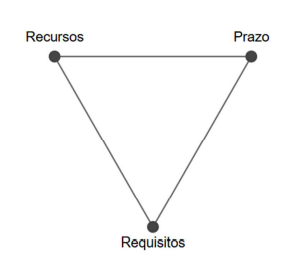
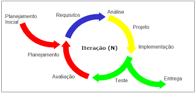

### 3.1 Estratégia Priorizada

## Abordagem de Desenvolvimento de Software

O projeto adotará a **abordagem ágil** de desenvolvimento de software. Esta abordagem foi escolhida por promover:

- Entregas incrementais  
- Priorização da colaboração contínua com o cliente  
- Adaptações rápidas às mudanças de requisitos

Essas características são essenciais para o contexto da franquia de academias, que está em expansão e requer soluções **flexíveis** e **evolutivas**.

{.centered-img}

A abordagem ágil se caracteriza por **recursos e prazos fixos**, com **variação nos requisitos**. Isso significa que se prioriza a **entrega dentro do prazo estipulado**, com os **recursos disponíveis**, garantindo que os **requisitos mais importantes para o funcionamento do sistema** sejam entregues primeiro.

## Ciclo de Vida

O ciclo de vida adotado será o **ciclo de vida iterativo incremental**, baseado em iterações curtas com entregas contínuas de valor. Esse modelo permite que funcionalidades críticas, como automação da comunicação com os alunos e painéis de análise de dados, sejam entregues e validadas pelo cliente de forma progressiva.

{.centered-img}

## Processo de Engenharia de Software

O processo de desenvolvimento escolhido é o **ScrumXP**, uma junção do framework Scrum com práticas do Extreme Programming (XP). O ScrumXP oferece um equilíbrio entre a organização dos papéis, eventos e artefatos do Scrum e as práticas técnicas do XP, como integração contínua, refatoração e desenvolvimento orientado a testes (TDD), o que garante qualidade de código desde o início e agilidade na adaptação das funcionalidades.

---

### 3.2 Quadro Comparativo

| **Critério** | **ScrumXP** | **FDD - Desenvolvimento Orientado a Funcionalidades** |
|--------------|-------------|--------------------------------------------------------|
| **Visão Geral** | Iterativo e incremental, com foco em agilidade e baixa exigência documental | Focado na implementação de funcionalidades específicas, dividindo o sistema em partes menores |
| **Tratamento da Arquitetura** | Arquitetura evolui conforme as necessidades; sem planejamento detalhado inicial | Uso de diagramas UML para modelar a estrutura, com apoio de diagramas de sequência |
| **Organização do Processo** | Ciclos curtos (sprints) de 2 a 4 semanas, com entregas contínuas | Iterações de 2 a 10 dias, com planejamento baseado em funcionalidades |
| **Adaptação de Requisitos** | Alta – requisitos mudam a cada ciclo conforme feedback do cliente | Moderada – mudanças são possíveis, mas há foco em funcionalidades específicas |
| **Participação do Cliente** | Alta – cliente acompanha, revisa e sugere melhorias a cada entrega | Menor – comunicação é feita via documentação detalhada entre equipe e cliente |
| **Nível de Complexidade** | Processo enxuto, com foco em colaboração e menor dependência de documentação | Mais estruturado, com uso intenso de modelagem e documentação técnica |
| **Técnicas Utilizadas** | Programação em dupla, TDD, integração contínua, refatoração, design simples | Criação e uso de diagramas UML, documentação detalhada e refinamento incremental |
| **Garantia de Qualidade** | Qualidade garantida por testes automatizados e TDD durante o desenvolvimento | Avaliação no final de cada iteração, com testes e inspeções dos incrementos |
| **Suporte às Equipes** | Equipes autônomas com comunicação direta e colaborativa | Suporta equipes maiores com estruturação formal do processo |

---

### 3.3 Justificativa

A escolha do **ScrumXP** como processo de engenharia de software se baseia na necessidade do projeto de adaptar-se constantemente às demandas do cliente e ao contexto de uma franquia em crescimento. A flexibilidade na priorização de funcionalidades e a entrega contínua de valor são aspectos fundamentais para validar rapidamente as soluções propostas, especialmente em um cenário onde a experiência do usuário e a eficiência operacional são decisivas para o sucesso do produto.

Além disso, as práticas técnicas oriundas do XP garantem uma base de código mais confiável e sustentável, enquanto o framework Scrum permite uma organização clara das tarefas da equipe, promovendo transparência, colaboração e melhoria contínua. Esses fatores tornam o ScrumXP a escolha mais alinhada com os objetivos e desafios do projeto.
