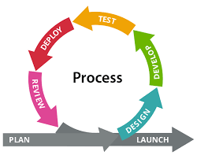

### 3.1 Estratégia Priorizada

## Abordagem de Desenvolvimento de Software

O projeto adotará a **abordagem ágil** de desenvolvimento de software. Esta abordagem foi escolhida por promover:

- Priorização da colaboração contínua com o cliente
- Adaptações rápidas às mudanças de requisitos

Essas características são essenciais para o contexto da franquia de academias, que está em expansão e requer soluções **flexíveis** e **evolutivas**.

{.centered-img}

A abordagem ágil se caracteriza por **recursos e prazos fixos**, com **variação nos requisitos**. Isso significa que se prioriza a **entrega dentro do prazo estipulado**, com os **recursos disponíveis**, garantindo que os **requisitos mais importantes para o funcionamento do sistema** sejam entregues primeiro.

## Ciclo de Vida

**Ciclo de Vida:** O ciclo de vida adotado será o ciclo de vida **Ágil**, com foco em entregas frequentes e iterativas de valor ao cliente, promovendo colaboração constante, resposta rápida a mudanças e melhoria contínua. Esse modelo favorece a validação antecipada de funcionalidades, como a automação da comunicação com os alunos e os painéis analíticos, garantindo alinhamento com as necessidades do usuário final ao longo do desenvolvimento.

{.centered-img}

## Processo de Engenharia de Software

O processo de desenvolvimento escolhido é o **DSDM (Dynamic Systems Development Method)**. O DSDM é uma estrutura ágil que fornece uma abordagem para o desenvolvimento e manutenção de sistemas, onde o tempo, o custo e a qualidade são restrições fixas, e os requisitos são priorizados e entregues incrementalmente. Ele enfatiza o envolvimento contínuo do usuário, equipes colaborativas, comunicação frequente e testes integrados. O DSDM se alinha bem com a necessidade de entregas rápidas e adaptabilidade em um ambiente de franquia em crescimento.

---

### 3.2 Quadro Comparativo

| **Critério** | **DSDM** | **FDD - Desenvolvimento Orientado a Funcionalidades** |
|--------------|----------|--------------------------------------------------------|
| **Visão Geral** | Iterativo e incremental, focado em entregas no prazo com envolvimento do usuário | Focado na implementação de funcionalidades específicas, dividindo o sistema em partes menores |
| **Tratamento da Arquitetura** | Arquitetura evolui, com um esboço inicial e refinamento contínuo | Uso de diagramas UML para modelar a estrutura, com apoio de diagramas de sequência |
| **Organização do Processo** | Fases bem definidas (Estudo de Viabilidade, Estudo de Negócio, Desenho Funcional, Construção, Implementação), com iterações dentro da fase de Construção | Iterações de 2 a 10 dias, com planejamento baseado em funcionalidades |
| **Adaptação de Requisitos** | Alta – requisitos priorizados e ajustados ao longo do projeto | Moderada – mudanças são possíveis, mas há foco em funcionalidades específicas |
| **Participação do Cliente** | Alta – envolvimento contínuo do usuário é fundamental | Menor – comunicação é feita via documentação detalhada entre equipe e cliente |
| **Nível de Complexidade** | Fornece uma estrutura mais formal dentro da agilidade | Mais estruturado, com uso intenso de modelagem e documentação técnica |
| **Técnicas Utilizadas** | Time-boxing rigoroso, prototipagem, workshops facilitados, modelagem | Criação e uso de diagramas UML, documentação detalhada e refinamento incremental |
| **Garantia de Qualidade** | Qualidade integrada ao longo do ciclo de vida, com testes contínuos | Avaliação no final de cada iteração, com testes e inspeções dos incrementos |
| **Suporte às Equipes** | Enfatiza equipes colaborativas e auto-organizadas dentro da estrutura DSDM | Suporta equipes maiores com estruturação formal do processo |

---

### 3.3 Justificativa

A escolha do **DSDM (Dynamic Systems Development Method)** como processo de engenharia de software se baseia na sua forte ênfase no envolvimento do usuário, entregas frequentes e no tratamento do tempo, custo e qualidade como restrições fixas. Dada a natureza dinâmica e em crescimento da franquia de academias, a capacidade do DSDM de priorizar requisitos e entregar valor de forma incremental, mantendo o foco nas necessidades do negócio, torna-o uma abordagem bem alinhada com os objetivos do projeto.

O envolvimento contínuo dos stakeholders garantido pelo DSDM facilitará a validação das funcionalidades desenvolvidas, como a automação da comunicação e as ferramentas de análise, assegurando que o sistema atenda às expectativas e necessidades das três franquias. Além disso, a estrutura do DSDM promove uma colaboração eficaz dentro da equipe e uma resposta adaptável às mudanças que possam surgir durante o desenvolvimento.
