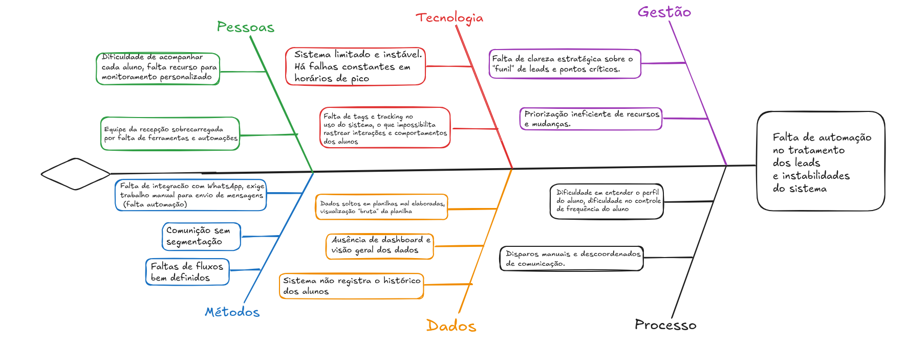

# 1. Cenário Atual do Cliente e do Negócio

## 1.1 Introdução ao Negócio e Contexto

Um dos segmentos que mais crescem é o meio fitness. Com o aumento do uso das redes sociais, esse segmento tem ganhado cada vez mais força, em especial o setor voltado ao bem-estar. Tendo isso em mente, nosso cliente é dono de duas franquias de studios fitness: **Vidya Yoga** e **Race Bootcamp**, ambas pertencentes ao grupo **Smart Fit**.

**Vidya Yoga** é um studio fitness que combina as práticas de yoga com uma sala aquecida a 40°C e iluminação que varia de acordo com os momentos e posições, utilizando paletas de cores quentes. Essa prática é conhecida como *hot yoga*. Sua principal missão é trazer tranquilidade à mente e ao corpo, alinhando ambos. Possui unidades em todas as regiões do Brasil, com foco em grandes capitais e áreas de alto poder aquisitivo. Seu público-alvo principal são mulheres jovens, de 20 a 40 anos, que se preocupam com sua saúde física e mental.

**Race Bootcamp** é um studio com equipamentos de academia, focado em esteiras e pesos livres. O controle da temperatura da sala e a iluminação são usados para incentivar os participantes a atingirem seu limite físico. É um ambiente controlado, onde os interessados podem usufruir dos equipamentos e orientação de professores, com o objetivo de descobrir e superar seus limites. Tem como principal propósito fornecer um ambiente ideal para que atletas amadores possam redefinir seus conceitos de limite físico. Assim como o Vidya Yoga, o Race Bootcamp está presente em todas as regiões do Brasil, com foco em grandes capitais e regiões de alto poder aquisitivo. Seu público-alvo são homens e mulheres jovens, de 25 a 40 anos, praticantes de corrida e atletas amadores interessados em conhecer seus próprios limites.

Ambas as franquias funcionam no sistema *pay per use*, sendo necessário comprar créditos pelos sites de cada studio fitness. Cada crédito equivale a uma determinada quantidade de aulas. Como ambos os studios possuem conceitos diferenciados dos studios fitness tradicionais, oferecem uma quantidade significativa de aulas experimentais, que podem ser agendadas pelo site, seguindo o mesmo processo da compra de créditos.

## 1.2 Identificação da Oportunidade ou Problema

O grupo Smart adquiriu recentemente uma startup chamada **Angulare**, que desenvolve um sistema de mesmo nome para a gestão de franquias de academias no modelo *pague pelo uso*. Com o sistema, é possível visualizar quantos créditos cada aluno possui, quantas visitas ele realizou ao studio, além da agenda dos studios, com horários e profissionais responsáveis por cada aula.

Nosso cliente, franqueado de academias, utiliza esse sistema e relata **inconsistências recorrentes**, como:

- Erros na exibição das informações
- Abas e páginas que deixam de aparecer aleatoriamente
- Instabilidade nos momentos de maior demanda — ou seja, durante os horários de pico da academia

Nessas ocasiões, o sistema fica fora do ar, obrigando os recepcionistas a anotarem informações de forma assíncrona e descentralizada, geralmente com papel e caneta, sem acesso aos dados necessários no site e possivelmente perdendo informação importante.

Outro ponto crítico é a total ausência de ferramentas de **análise de dados** já concentrados no sistema. Não há nenhuma funcionalidade que permita o cruzamento de informações para identificar, por exemplo:

- Clientes mais inativos
- Clientes que participaram de uma aula experimental e não retornaram
- Clientes que estão prestes a ficar sem créditos

Com base nessas informações, é possível alinhar uma demanda já expressa pelo dono das franquias: **o envio automatizado de mensagens aos clientes**, com o objetivo de melhorar o atendimento, fidelizar e recuperar alunos.

Isso eliminaria essa etapa essencial da rotina da recepção, atualmente feita de forma manual e, segundo o cliente, com baixa efetividade, já que os responsáveis frequentemente deixam de enviar as mensagens, e ele não consegue acompanhar essa tarefa de forma adequada.

## 1.3 Desafios do Projeto

Os principais desafios enfrentados pelo cliente envolvem:

- A operacionalização manual de processos
- A exigência de tempo da equipe para revisar dados de presença e comportamento dos alunos
- A falta de integração de dados, dificultando a análise e tomada de decisões
- A baixa automação na comunicação, que impacta negativamente a experiência dos alunos
- A escalabilidade do modelo atual, que compromete a padronização com o crescimento da franquia
- O desafio técnico de fornecer **constância para o sistema nos horários de pico**

## 1.4 Segmentação de Clientes

O sistema seria usado basicamente por apenas um grupo:

- **Usuários das franquias**: Esse grupo não utilizará diretamente o sistema, mas sim as franquias. São homens e mulheres de alto poder aquisitivo entre 25 e 40 anos que possuem grande interesse em saúde e bem-estar.

- **Recepcionistas (18 a 40 anos)**: Grupo formado por pessoas de diferentes idades, com no mínimo um conhecimento básico em tecnologia. São capazes de operar sistemas de forma simples e funcional, mas não possuem domínio avançado sobre ferramentas mais complexas.

- **Gerente/Dono da franquia**: Grupo formado pelos possíveis gerentes que podem vir a ser contratados caso o negócio escale, e o dono da franquia. São capazes de operar o sistema com desenvoltura e possuem ênfase em acompanhar e verificar o trabalho feito.
