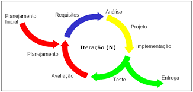

## Ciclo de Vida

O ciclo de vida adotado será o **ciclo de vida iterativo incremental**, baseado em iterações curtas com entregas contínuas de valor. Esse modelo permite que funcionalidades críticas, como automação da comunicação com os alunos e painéis de análise de dados, sejam entregues e validadas pelo cliente de forma progressiva.

{.centered-img}
